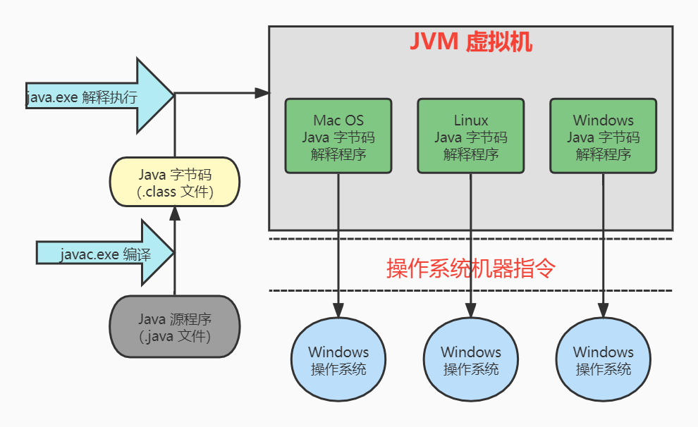
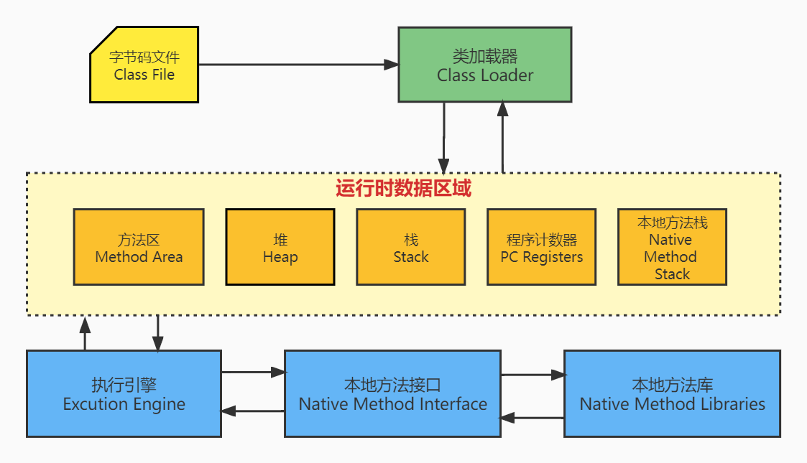
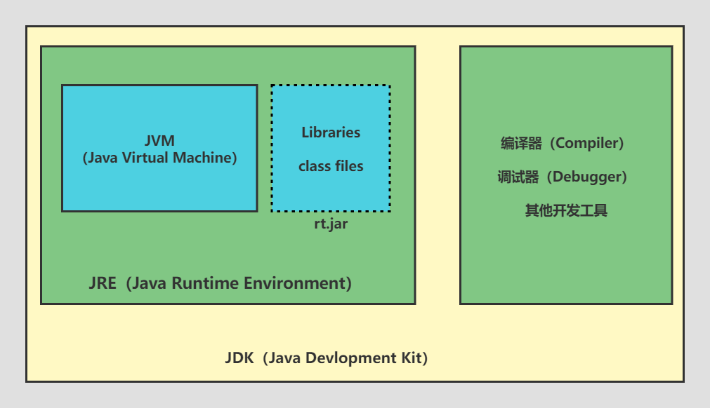

# JDK&JRE&JVM

## 背景
Java 是一门高级语言，一个用高级语言编写的程序，不能在任何机器上直接运行。需要将其翻译成特定的机器语言才可以运行。Javac 编译器就是做这个翻译的工作的，它把 Java 源程序（`.java` 文件）翻译成 JVM 可以执行的机器码（bytecode 字节码 `.class`文件）。
​

JVM 是运行在真实机器（如你的电脑）上的虚拟机，它的机器语言就是字节码。
​

JVM 使得编译器的工作简单化，因为编译器不用为每种机器生成不同的机器码，只需要生成 JVM 可以执行字节码即可。
​

总而言之，JVM 主要功能是执行 Java 源代码编译而成的字节码。每个操作系统拥有不同的 JVM, 但是它们执行相同字节码得到的结果是相同的。这就是说，在 Windows 上编译的字节码可以在 Windows 执行，也可以 Linux、Mac OS 等平台上执行，所以 JVM 使 Java 成为一门平台独立的语言。
​

Java 程序执行流程图：  

## JVM 结构体系

下面我们来介绍一下 JVM 是怎么工作的：

### Class Loader（类加载器）
 加载`.class`文件并且把读到的字节码写入 Method Area（方法区），Java 中加载类使用**双亲委派模型**，每个类只会被加载一次，双亲委派模型以后再详细介绍。
### Method Area（方法区）
方法区又叫静态区，JVM 只有一个方法区，被所有线程共享，它保存着[**类加载器**](#dH5t1)加载类提取的信息，它包含的都是在整个程序中永远唯一的元素，如`class`, `static `变量。
### Heap（堆）
堆是 JVM 用来为对象分配空间的一块内存，JVM 每加载一个`.class`文件都会创建一个`Class`对象。
### Stack（栈）
虚拟机栈也是 JVM 分出来一块内存，专门用来存放程序的临时变量。
### PC Registers（程序计数器）
程序计数器用来记录程序执行到哪一个指令，下个指令执行什么。因为指令是由线程执行的，所以每个线程都有一个单独的程序计数器。
### Native Method Stack（本地方法栈）
本地方法栈与[虚拟机栈](#cSOs5)所发挥的作用是非常相似的，只不过虚拟机栈为虚拟机执行 Java 方法（也就是字节码）服务，而本地方法栈则为虚拟机使用到的 Native 方法服务。
> Tip：
> - 在虚拟机规范中对本地方法栈中方法使用的语言、使用方式与数据结构并没有强制规定，因此具体的虚拟机可以自由实现它。
> - 甚至有的虚拟机（如Sun HotSpot虚拟机）直接就把本地方法栈和虚拟机栈合二为一。
> - 与虚拟机栈一样，本地方法栈区域也会抛出StackOverflowError和OutOfMemoryError异常。

### Native Method Interface（本地方法接口）
本地方法接口使 Java 代码能够调用本机应用程序，本机应用程序是特定于系统硬件和操作系统的程序。
> Tip：
> 本地方法接口是根据本地方法栈中登记`native`标记的本地仓库生成的。
> 即 Java 中用`native`修饰的方法，会先被在本地方法栈（Native Method Stack）中登记，然后会根据这个本地方法生成一个对应的本地接口，最后在启动执行引擎Execution Engine的时候，会根据本地接口去本地方法库中加载对应的实现方法，然后执行这个方法。

### Garbage Collection（垃圾收集器）
我们在 Java 代码中显式地创建类的实例对象，使用之后垃圾收集器会帮我们自动销毁，不需要我们自己进行内存管理。
## JVM Vs JRE Vs JDK
### JRE（Java Runtime Environment）
JRE 是Java 的运行时环境，它包含 JVM,类库和其他一些文件，但是不包括开发工具，如编译器、调试器...
就是说，安装了 JRE 环境后可以运行 Java 程序，但不能开发编译 Java 程序。
### JVM（Java Virtual Machine）
如上所述，JVM 通过 JRE 提供的类、库和文件来运行程序。
### JDK（Java Devlopment Kit）
JDK 是 JRE 的超集，它包含了 JRE,并且多了一些其他工具，如编译器、调试器...
### 关系图

##  阅读资料
- [初学者教程-Java](https://beginnersbook.com/2013/05/jvm/)
