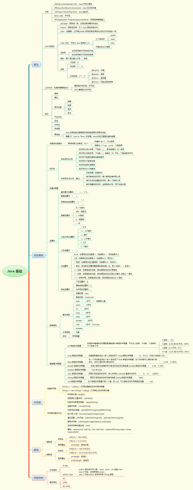

# Java SE

* [Java 简介](Java%20简介)
* [JDK&JRE&JVM](JDK&JRE&JVM)
* [运行第一个 Java 程序](运行第一个%20Java%20程序)
* [变量](变量)
* [操作符](操作符)
* [数据类型](数据类型)
* [字符串](字符串)
* [数组](数组)
* [流程控制](流程控制/)

Java基础-思维导图 [新标签页中打开查看](../imgs/Java基础-思维导图.png ':ignore')  
