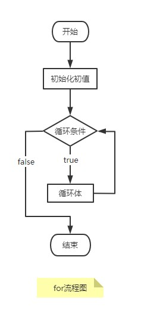

# for 循环

## 背景
循环用于重复执行一组语句直到循环条件不再成立则结束。  

在 Java 中有 3 种类型的循环，分别是 `for` 、 `while` 、 `do-while`，本篇先介绍 `for` 循环。  
其语法格式如下：  
```java
for(初始化初值; 循环条件; 迭代语句){
    循环体代码;
}
```

## for 循环执行流程
流程图如下：  
  

for语句的代码执行过程：  
1. 初始化初值；
2. 判断循环条件是否成立，如果循环条件为 `false` ，则结束循环，否则执行下一步；
3. 执行循环体；
4. 执行迭代；
5. 跳转到步骤2重复执行。  

补充说明：  
- 初始化初值一般是循环变量的声明、赋值等，它在 `for` 语句中执行且只执行一次。可以为空；
- 循环条件，要求必须为布尔类型，如果该条件为空，则默认为 `true`，即条件成立；
- 迭代语句，是指循环变量变化的语句，一般书写 `i++` 、`i--` 这样的结构。该语句可以为空。
- 循环体指循环重复执行的功能代码。
- 花括号{}不是必须的，当循环体部分只有一条语句时可以省略。

## 代码示例

### 简单示例
```java
/**
 * 用 main 方法调用执行结果：
 *
 * i = 0
 * i = 1
 * i = 2
 * i = 3
 * i = 4
 */
public static void simple(){
    /**
     * int i = 0;   // 循环变量赋初值为 0，只执行一次
     * i < 10;      // 循环条件
     * i++          // 迭代条件
     */
    for (int i = 0; i < 5; i++) {
        System.out.println("i = " + i);
    }
}
```

以上代码中 `i` 加到 `5` 时，不再小于 `5`，循环条件不成立循环就结束了。

### 无限循环
```java
public static void infinite (){
    for (int i = 1; i > 0; i++) {
        System.out.println("i = " + i);
    }
}
```

在上面的代码中，`i` 的初值为 `1`，循环条件为` i > 0`，而迭代语句是 `i++`，每次执行之后 `+1`，所以 `i` 只会越来越大，循环条件一直成立，循环就不会终止。  

因此我们在设计循环的应该协调循环条件与迭代语句的之间的关系，使循环总能达到某个临界值而终止。  

一个简单的死循环，循环条件不写默认为 `true`
```java
for(;;){
    循环体;
}
```

### 循环遍历数组
```java
/**
 * 用 main 方法调用执行结果：
 * 
 * arr[0] = 2
 * arr[1] = 4
 * arr[2] = 6
 * arr[3] = 7
 */
public static void arrayFor (){
    int arr[] = {2, 4, 6, 7};
    for (int i = 0; i < arr.length; i++) {
        System.out.println("arr[" + i + "] = " + arr[i]);
    }
}
```

使用增强 for 循环打印数组:
```java
/**
 * 用 main 方法调用执行结果：
 *
 * a = 2
 * a = 4
 * a = 6
 * a = 7
 */
public static void arrayEnhancedFor (){
    int arr[] = {2, 4, 6, 7};
    for (int a : arr) {
        System.out.println("a = " + a);
    }
}
```

> for(int a : arr) 中 int a 是根据数组的类型动态变化的。

## 阅读资料
* [初学者教程 for-loop](https://beginnersbook.com/2015/03/for-loop-in-java-with-example/)