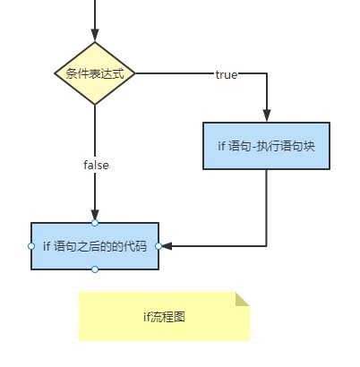
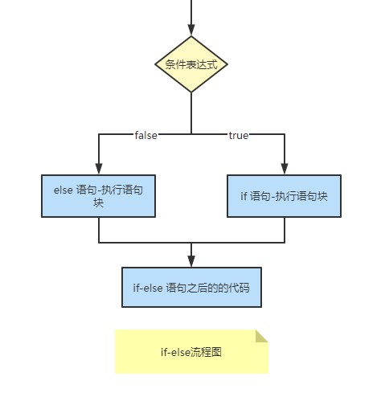

# if-else 分支

当我们基于一定条件执行一系列语句时，我们会使用到控制流语句。

比如，我们输入一个数字，如果它大于零则打印"正数",如果小于零则打印"负数",这种情况下，我们程序中有两个打印语句，但基于我们输入的数字，只会执行其中一条。

下面我们来看看怎么在 Java 中使用控制语句。

## 多种 if 语句

本篇会介绍以下四种控制语句，我们可以根据需求使用它们。

- if 语句
- 嵌套 if 语句
- if-else 语句
- if-else if 语句

### if 语句

if 语句包括一个条件，后面会紧跟一个或一系列语句，格式如下：

```java
if(条件表达式){
    语句块;
}
```

只有当条件表达式成立(true)时，`if` 的语句块才会执行，否则 `if` 的语句块会直接忽略，执行之后的代码，流程图如下：  


if 语句代码示例：

```java
public class IfStatement {
    /**
     *
     * 输入：3
     * main 方法执行结果：
     *
     * 请输入数字：3
     * 3是正数！
     * 程序结束
     */
    public static void main(String[] args) {
        Scanner scanner = new Scanner(System.in);
        System.out.print("请输入数字：");
        int inputInt = scanner.nextInt();
        if (inputInt > 0) {
            System.out.println(inputInt + "是正数！");
        }
        scanner.close();
        System.out.println("程序结束");
    }
}
```

### 嵌套 if 语句

如果一个 `if` 语句中有另外一个 `if` 语句，我们称为嵌套 `if` 语句。语法格式如下：

```java
if(条件表达式1){
    语句块1;
    //...
    if(条件表达式2){
        语句块2;
    }
}
```

当`条件表达式1`成立(true),`语句块1`才会执行，当`条件表达式1`与`条件表达式2`都成立才会执行`语句块2`的代码。流程图就不画了，我们直接看示例代码：

```java
public class NestedIfStatement {
    /**
     *
     * 输入：4
     * main 方法执行结果：
     *
     * 请输入数字：4
     * 4是正数！
     * 4还是偶数！
     * 程序结束
     */
    public static void main(String[] args) {
        Scanner scanner = new Scanner(System.in);
        System.out.print("请输入数字：");
        int inputInt = scanner.nextInt();
        if (inputInt > 0) {
            System.out.println(inputInt + "是正数！");
            if (inputInt % 2 == 0) {
                System.out.println(inputInt + "还是偶数！");
            }
        }
        scanner.close();
        System.out.println("程序结束");
    }
}
```

### if-else 语句

if-else 语句语法格式如下：

```java
if(条件表达式){
    语句块1;
}else{
    语句块2;
}
```

当`条件表达式`成立时，执行`语句块1`的代码，否则执行`语句块2`的代码。流程图如下：  


看下面代码示例：

```java
public class IfElseStatement {
    /**
     *
     * 输入：5
     * main 方法执行结果：
     *
     * 请输入数字：5
     * 5是奇数！
     * 程序结束
     */
    public static void main(String[] args) {
        Scanner scanner = new Scanner(System.in);
        System.out.print("请输入数字：");
        int inputInt = scanner.nextInt();
        if (inputInt % 2 == 0) {
            System.out.println(inputInt + "是偶数！");
        }else {
            System.out.println(inputInt + "是奇数！");
        }
        scanner.close();
        System.out.println("程序结束");
    }
}
```

### if-else if 语句

当检查的条件有多个时，我们就会用到 `if-else if` 语句，在这个语句中我只能有一个 `if` 和一个 `else`, 但是可以有多个 `else if` 语句。语法格式如下：

```java
if(条件表达式1){
    语句块1;
}
else if(条件表达式2){
    语句块2;
}
else if(条件表达式3){
    语句块3;
}
// ...
else if(条件表达式n){
    语句块n;
}
else{
    语句块-else;
}
```

> Tip: if-else if 语句中，一旦有条件成立，相对的语句块就会执行，其他语句块都会被忽略，直接跳转至 if-else if 语句之后的代码执行；如果没有任何条件成立，则会执行 else 语句块的内容（如果有 else 语句块）。

if-else if 语句代码示例：

```java
public class IfElseIfStatement {
    /**
     *
     * 输入：0
     * main 方法执行结果：
     *
     * 请输入数字：0
     * 0是零！
     * 程序结束
     */
    public static void main(String[] args) {
        Scanner scanner = new Scanner(System.in);
        System.out.print("请输入数字：");
        int inputInt = scanner.nextInt();
        if (inputInt > 0) {
            System.out.println(inputInt + "是正数！");
        }else if(inputInt < 0){
            System.out.println(inputInt + "是负数！");
        }else {
            System.out.println(inputInt + "是零！");
        }
        scanner.close();
        System.out.println("程序结束");
    }
}
```

## 阅读资料

- [初学者教程 if-else](https://beginnersbook.com/2017/08/if-else-statement-in-java/)
