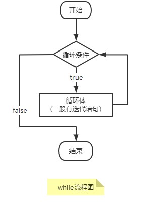

# while 循环

本篇学习一种新的循环—— `while` 循环。  
语法格式如下:

```java
while(循环条件){
    循环体代码;
}
```

## while 循环执行流程

先看它的执行流程图：  


在 `while` 循环中，首先判断循环条件是否成立，成立(为`true`)则执行循环体代码；不成立(为`false`)则直接跳过循环，执行循环之后的代码。

> Tip: 在 `while` 或 `do-while` 循环中，循环体代码一般包含迭代语句(`i++`、`i--`等)，不然循环不会迭代就成了死循环。

## 代码示例

### 简单示例

```java
    /**
     * 用 main 方法调用执行结果：
     *
     * 5
     * 4
     * 3
     * 2
     * 1
     */
    public static void simple(){
        int i = 5;
        while (i > 0){
            System.out.println(i--);
        }
    }
```

### 无限循环

```java
    public static void infinite (){
        int i = 10;
        while (i > 0){
            // 无迭代条件，就会无限循环
            System.out.println(i);
        }
    }
```

另一种 `while` 无限循环，循环条件直接设为 `true`

```java
while(true){
    循环体;
}
```

### while 循环遍历数组

```java
    /**
     * 用 main 方法调用执行结果：
     *
     * arr[0] = 4
     * arr[1] = 5
     * arr[2] = 6
     * arr[3] = 7
     */
    public static void arrayWhile (){
        int arr[] = {4, 5, 6, 7};
        int i = 0;
        while (i < arr.length) {
            System.out.println("arr[" + i + "] = " + arr[i]);
            i++;
        }
    }
```

## 阅读资料

- [初学者教程 while-loop](https://beginnersbook.com/2015/03/while-loop-in-java-with-examples/)
