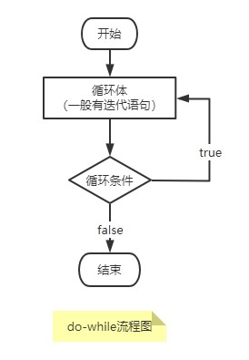

# do-while 循环

本篇学习 `do-while` 循环，它和 `while` 循环相似，只不过 `while` 循环是首先判断循环条件，而 `do-while` 循环是先执行一次循环体代码，接着才去判断循序条件。  
其语法格式如下：

```java
do{
    循环体代码;
}while(循环条件);
```

## do-while 循环执行流程

先看它的执行流程图：  


先执行一次循环体代码，接着才判断循环条件，循环条件成立(为`true`)则继续执行循环体代码；不成立(为`false`)则跳过循环，执行循环之后的代码。

> Tip: `do-while` 必定会执行一次循环体。  
> 在 `while` 或 `do-while` 循环中，循环体代码一般包含迭代语句(`i++`、`i--`等)，不然循环不会迭代就成了死循环。

## 代码示例

### 简单示例

```java
    /**
     * 用 main 方法调用执行结果：
     *
     * 5
     * 4
     * 3
     * 2
     * 1
     */
    public static void simple(){
        int i = 5;
        do{
            System.out.println(i--);
        }
        while (i > 0);
    }
```

### do-while 循环遍历数组

```java
    /**
     * 用 main 方法调用执行结果：
     *
     * arr[0] = 81
     * arr[1] = 14
     * arr[2] = 25
     * arr[3] = 33
     */
    public static void arrayWhile (){
        // int arr[]; // 1. 未初始化数组，编译不通过

        // int arr[] = {}; //2. 索引 0 出无值数组越界

        int arr[] = {81, 14, 25, 33};
        int i = 0;
        do{
            // 数组必须初始化，并且保证索引 0 出有值，不然会编译不通过或数组越界
            System.out.println("arr[" + i + "] = " + arr[i]);
            i++;
        }while (i < arr.length);
    }
```

## 阅读资料

- [初学者教程 do-while-loop](https://beginnersbook.com/2015/03/do-while-loop-in-java-with-example/)
