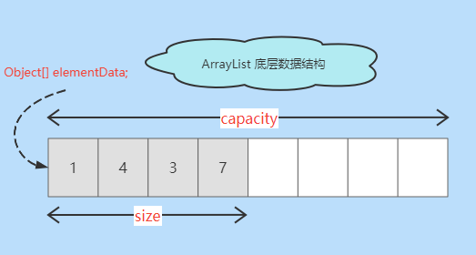

# ArrayList

## 简介
`ArrayList` 是 `List` 接口的可变数组的实现。  

`ArrayList` 是一个顺序容器，即元素存放的数据与放进去的顺序相同，且允许放入 `null` 元素，底层通过数组实现。 

Java 泛型只是编译器提供的语法糖，所以这里的数组是一个 `Object` 数组，以便能够容纳任何类型的对象。   

每个 `ArrayList` 都有一个容量 `capacity`，表示底层数组的实际大小，容器内存储元素的个数不能多于当前容量，
当向容器中添加元素时，如果容量不足，容器会自动扩容，增大底层数组的大小。

- `size()`, `isEmpty()`, `get()`, `set()` 方法均能在常数时间内完成  
- `add()` 方法的时间开销跟插入位置有关
- `addAll()` 方法的时间开销跟添加元素的个数成正比
- 其余方法大都是线性时间。 

> Tip: 为追求效率，`ArrayList` 没有实现同步`synchronized`，如果需要多个线程并发访问，用户可以手动同步，也可使用 `Vector` 替代。 
 
## 底层数据结构
```java
    /**
     * The array buffer into which the elements of the ArrayList are stored.
     * The capacity of the ArrayList is the length of this array buffer. Any
     * empty ArrayList with elementData == DEFAULTCAPACITY_EMPTY_ELEMENTDATA
     * will be expanded to DEFAULT_CAPACITY when the first element is added.
     * 底层数组
     */
    transient Object[] elementData; // non-private to simplify nested class access

    /**
     * The size of the ArrayList (the number of elements it contains).
     * 元素的个数
     * @serial
     */
    private int size;
```  

  

> `size` 是存储元素的实际个数， `capacity` 是底层数组的大小。

## 默认常量

```java
    /**
     * Default initial capacity. 
     * 默认初始容量 10
     */
    private static final int DEFAULT_CAPACITY = 10;

    /**
     * Shared empty array instance used for empty instances. 
     * 共享空数组实例 
     */
    private static final Object[] EMPTY_ELEMENTDATA = {};

    /**
     * Shared empty array instance used for default sized empty instances. We
     * distinguish this from EMPTY_ELEMENTDATA to know how much to inflate when
     * first element is added.
     * 默认初始容量的共享空数组实例，与 EMPTY_ELEMENTDATA 区分，用来了解添加第一个的元素的膨胀过程
     */
    private static final Object[] DEFAULTCAPACITY_EMPTY_ELEMENTDATA = {};

    /**
     * The maximum size of array to allocate.
     * Some VMs reserve some header words in an array.
     * Attempts to allocate larger arrays may result in
     * OutOfMemoryError: Requested array size exceeds VM limit
     * 数组的最大容量
     */
    private static final int MAX_ARRAY_SIZE = Integer.MAX_VALUE - 8;
```

## 构造方法

```java
    /**
     * Constructs an empty list with the specified initial capacity.
     * 构造一个具有指定初始容量的空列表。
     * @param  initialCapacity 列表的初始容量 the initial capacity of the list
     * @throws IllegalArgumentException if the specified initial capacity
     *         is negative
     */
    public ArrayList(int initialCapacity) {
        if (initialCapacity > 0) {
            // 创建一个指定大小的数组
            this.elementData = new Object[initialCapacity];
        } else if (initialCapacity == 0) {
            // 引用共享空数组实例
            this.elementData = EMPTY_ELEMENTDATA;
        } else {
            throw new IllegalArgumentException("Illegal Capacity: "+ initialCapacity);
        }
    }

    /**
     * Constructs an empty list with an initial capacity of ten.
     * 构造一个初始容量为 10 的空列表
     */
    public ArrayList() {
        // 引用默认初始容量的共享空数组实例
        this.elementData = DEFAULTCAPACITY_EMPTY_ELEMENTDATA;
    }

    /**
     * Constructs a list containing the elements of the specified
     * collection, in the order they are returned by the collection's
     * iterator.
     * 构造一个包含指定集合元素的列表
     * @param c 指定集合 the collection whose elements are to be placed into this list
     * @throws NullPointerException if the specified collection is null
     */
    public ArrayList(Collection<? extends E> c) {
        Object[] a = c.toArray();
        if ((size = a.length) != 0) {
            if (c.getClass() == ArrayList.class) {
                elementData = a;
            } else {
                elementData = Arrays.copyOf(a, size, Object[].class);
            }
        } else {
            // replace with empty array.
            elementData = EMPTY_ELEMENTDATA;
        }
    }
```

## 自动扩容机制

每当向数组中添加元素时，都要去检查添加后元素的个数是否会超出当前数组的长度，如果超出，数组将会进行扩容，以满足添加数据的需求。  

数组扩容通过一个公开的方法 `ensureCapacity(int minCapacity)` 来实现。

> Tip: 数组进行扩容时，会将老数组中的元素重新拷贝一份到新的数组中，每次数组容量的增长大约是其原容量的 `1.5` 倍。这种操作的代价是很高的，因此在实际使用时，我们应该尽量避免数组容量的扩张。
> - 当我们可预知要保存的元素的多少时，在构造 `ArrayList` 实例时就指定其容量，以避免数组扩容的发生。
> - 或者根据实际需求，通过调用 `ensureCapacity` 方法来手动增加 `ArrayList` 实例的容量。

```java
    /**
     * Increases the capacity of this <tt>ArrayList</tt> instance, if
     * necessary, to ensure that it can hold at least the number of elements
     * specified by the minimum capacity argument.
     * 确保容量
     * 确保数组容量最小是 minCapacity | 至少可存储 minCapacity 个元素
     * @param   minCapacity  所需最小容量/最少可存储元素个数  the desired minimum capacity
     */
    public void ensureCapacity(int minCapacity) {
        int minExpand = (elementData != DEFAULTCAPACITY_EMPTY_ELEMENTDATA)
            // 如果底层数组 不是默认初始容量的共享空数组实例
            ? 0
            // 如果底层数组 是默认初始容量的共享空数组实例
            : DEFAULT_CAPACITY;

        if (minCapacity > minExpand) {
            // 确保显式容量
            ensureExplicitCapacity(minCapacity);
        }
    }

    /**
     * 计算最小需要容量
     * - 如果数组是 默认初始容量的共享空数组实例 取 最小需要容量(minCapacity) 和 默认初始容量(DEFAULT_CAPACITY) 10 的较大值
     * - 否则 取参数 minCapacity 所需最小容量
     * @param elementData 数组
     * @param minCapacity 所需最小容量/最少可存储元素个数
     * @return 所需最小容量
     */
    private static int calculateCapacity(Object[] elementData, int minCapacity) {
        // 如果数组是 默认初始容量的共享空数组实例 
        if (elementData == DEFAULTCAPACITY_EMPTY_ELEMENTDATA) {
            // 取 所需最小容量(minCapacity) 和 默认初始容量(DEFAULT_CAPACITY) 10 的较大值。
            return Math.max(DEFAULT_CAPACITY, minCapacity);
        }
        // 取 所需最小容量(minCapacity)
        return minCapacity;
    }

    /**
     * 确保内部容量
     * 确保数组容量最小是 minCapacity | 至少可存储 minCapacity 个元素
     * @param   minCapacity  所需最小容量/最少可存储元素个数  the desired minimum capacity
     */
    private void ensureCapacityInternal(int minCapacity) {
        // 计算所需最小容量 -> 确保数组最小需要容量
        ensureExplicitCapacity(calculateCapacity(elementData, minCapacity));
    }

    /**
     * 确保显式容量
     * 确保数组容量最小是 minCapacity | 至少可存储 minCapacity 个元素
     * @param   minCapacity  所需最小容量/最少可存储元素个数  the desired minimum capacity
     */
    private void ensureExplicitCapacity(int minCapacity) {
        // 修改次数 +1
        modCount++;

        // overflow-conscious code
        // 如果 所需最小容量 大于 原数组 长度
        if (minCapacity - elementData.length > 0)
            // 扩容处理
            grow(minCapacity);
    }

    /**
     * Increases the capacity to ensure that it can hold at least the
     * number of elements specified by the minimum capacity argument.
     * 扩容 - 增加容量以确保至少可以容纳 minCapacity 元素数量
     * @param minCapacity 所需最小容量/最少可存储元素个数 the desired minimum capacity
     */
    private void grow(int minCapacity) {
        // overflow-conscious code
        // 旧容量
        int oldCapacity = elementData.length;

        // 新容量 为 旧容量的 1.5 倍 (增加旧容量的一半)
        int newCapacity = oldCapacity + (oldCapacity >> 1);

        // 如果 新容量(增加旧容量的一半) 还是小于 所需最小容量
        if (newCapacity - minCapacity < 0)
            // 把 新容量 赋值为 参数 minCapacity 所需最小容量
            newCapacity = minCapacity;

        // 如果 新容量 大于最大数组容量
        if (newCapacity - MAX_ARRAY_SIZE > 0)
            // 进行巨大容量处理
            newCapacity = hugeCapacity(minCapacity);

        // minCapacity is usually close to size, so this is a win:
        // 赋值原底层数组内容 到 新的数组，再把新数组赋值给底层数组
        elementData = Arrays.copyOf(elementData, newCapacity);
    }

    /**
     * 巨大的容量
     * @param minCapacity 所需最小容量/最少可存储元素个数 the desired minimum capacity
     */
    private static int hugeCapacity(int minCapacity) {
        // 如果 所需最小容量 范围溢出 则 抛异常
        if (minCapacity < 0) // overflow 
            throw new OutOfMemoryError();
        // 如果 所需最小容量 未范围溢出且大于数组最大容量，取整数最大值，否则取数组的最大容量
        return (minCapacity > MAX_ARRAY_SIZE) ?
            Integer.MAX_VALUE :
            MAX_ARRAY_SIZE;
    }
```


## 阅读资料

- [全栈知识体系-ArrayList源码解析](https://www.pdai.tech/md/java/collection/java-collection-ArrayList.html)
- [CarpenterLee-ArrayList源码解析](https://www.cnblogs.com/CarpenterLee/p/5419880.html)
- [zhangshixi-ArrayList源码解析](https://www.iteye.com/blog/zhangshixi-674856)