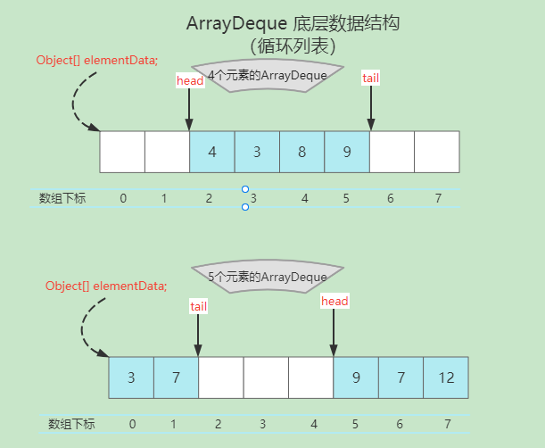

# ArrayDeque

## 概述

Java 里有一个叫做 `Stack` 的类，却没有叫做 `Queue` 的类(它是个接口)。

- 当需要使用栈时，Java 已不推荐使用 `Stack`，而是推荐使用更高效的 `ArrayDeque`   

- 当需要使用队列时，既然 `Queue` 只是一个接口，当然首选也是它的实现类 `ArrayDeque` 了，次选是 `LinkedList` 

## Queue

`Queue` 接口继承自 `Collection` 接口，除了最基本的 `Collection` 的方法之外，它还支持队列的 `insertion` (插入), `extraction` (取出) 和 `inspection` (取值)操作。  
这里有两组格式，共 6 个方法，一组是抛出异常的实现；另外一组是返回值的实现(没有则返回 null)。

|         | Throws exception | Returns special value |
| ------- | ---------------- | --------------------- |
| Insert  | add(e)           | offer(e)              |
| Remove  | remove()         | poll()                |
| Examine | element()        | peek()                |

## Deque

`Deque`是"double ended queue", 表示双向的队列，英文读作"deck".   
`Deque` 继承自 `Queue` 接口，除了支持 `Queue` 的方法之外，因为队列是双向的，还支持队列头和尾的`insert`, `remove`和`examine`操作。  
它同时也支持两组格式，一组是抛出异常的实现；另外一组是返回值的实现(没有则返回 null)。  
共 12 个方法如下:

|         | First Element - Head |               | Last Element - Tail |               |
| ------- | -------------------- | ------------- | ------------------- | ------------- |
|         | Throws exception     | Special value | Throws exception    | Special value |
| Insert  | addFirst(e)          | offerFirst(e) | addLast(e)          | offerLast(e)  |
| Remove  | removeFirst()        | pollFirst()   | removeLast()        | pollLast()    |
| Examine | getFirst()           | peekFirst()   | getLast()           | peekLast()    |

当把 `Deque` 当做 FIFO 的 `Queue` 来使用时，元素是从 `Deque` 的尾部添加，从头部进行删除的
下表列出了 `Deque` 与 `Queue` 对应的方法:

| Queue Method | Equivalent Deque Method | 说明                                   |
| ------------ | ----------------------- | -------------------------------------- |
| `add(e)`     | `addLast(e)`            | 向队尾插入元素，失败则抛出异常         |
| `offer(e)`   | `offerLast(e)`          | 向队尾插入元素，失败则返回`false`      |
| `remove()`   | `removeFirst()`         | 获取并删除队首元素，失败则抛出异常     |
| `poll()`     | `pollFirst()`           | 获取并删除队首元素，失败则返回`null`   |
| `element()`  | `getFirst()`            | 获取但不删除队首元素，失败则抛出异常   |
| `peek()`     | `peekFirst()`           | 获取但不删除队首元素，失败则返回`null` |

当把 `Deque` 当做 LIFO 的 `Stack` 来使用时，元素是从 `Deque` 的头部添加和删除的  
下表列出了 `Deque` 与 `Stack` 对应的接口:

| Stack Method | Equivalent Deque Method | 说明                                   |
| ------------ | ----------------------- | -------------------------------------- |
| `push(e)`    | `addFirst(e)`           | 向栈顶插入元素，失败则抛出异常         |
| 无           | `offerFirst(e)`         | 向栈顶插入元素，失败则返回`false`      |
| `pop()`      | `removeFirst()`         | 获取并删除栈顶元素，失败则抛出异常     |
| 无           | `pollFirst()`           | 获取并删除栈顶元素，失败则返回`null`   |
| `peek()`     | `peekFirst()`           | 获取但不删除栈顶元素，失败则抛出异常   |
| 无           | `peekFirst()`           | 获取但不删除栈顶元素，失败则返回`null` |

> - `ArrayDeque` 和 `LinkedList` 是 `Deque` 的两个通用实现，但官方更推荐使用 `ArrayDeque` 用作栈和队列。  
> - 从名字可以看出 `ArrayDeque` 底层通过数组实现，为了满足可以同时在数组两端插入或删除元素的需求，该数组还必须是循环的，即`循环数组(circular array)`，也就是说数组的任何一点都可能被看作起点或者终点。
> - `ArrayDeque` 是非线程安全的(not thread-safe)，当多个线程同时使用的时候，需要程序员手动同步；另外，该容器不允许放入`null`元素。

## 底层数据结构

  

> Tip： `head` 指向首端第一个有效元素，`tail` 指向尾端第一个可以插入元素的空位。因为是循环数组，所以 `head` 不一定总等于 `0` ，`tail` 也不一定总是比 `head` 大。

```java
    /**
     * 存储双端队列元素的数组。
     * 双端队列的容量就是这个数组的长度，它总是 2 的指数倍。
     * 数组永远不允许变满，除非在 addX 方法中短暂地在变满后立即调整大小（请参阅 doubleCapacity），从而避免头部和尾部环绕以彼此相等。
     * 我们还保证所有元素的不能为 null 。
     */
    transient Object[] elements; // non-private to simplify nested class access

    /**
     * 双端队列头部元素的索引（将被 remove() 或 pop() 删除的元素）
     * 如果双端队列为空，则为等于 tail 的任意数字。
     */
    transient int head;

    /**
     * 将下一个元素添加到双端队列尾部的索引（通过 addLast(E)、add(E) 或 push(E)）
     */
    transient int tail;

    /**
     * 我们将用于新创建的双端队列的最小容量。必须是 2 的指数倍
     */
    private static final int MIN_INITIAL_CAPACITY = 8;
```

## 构造方法

```java
    /**
     * 构造一个空数组双端队列，其初始容量足以容纳 16 个元素
     */
    public ArrayDeque() {
        elements = new Object[16];
    }

    /**
     * 构造一个空数组双端队列，其初始容量足以容纳指定数量的元素(2的最佳幂)
     */
    public ArrayDeque(int numElements) {
        allocateElements(numElements);
    }

    /**
     * 按照集合的迭代器返回的顺序构造一个包含指定集合元素的双端队列
     */
    public ArrayDeque(Collection<? extends E> c) {
        allocateElements(c.size());
        addAll(c);
    }
```

## 添加元素

- `addFirst(E e)`  - 队列首部添加元素，其他队列首部添加元素的方法都是直接或间接包装此方法实现
- `offerFirst(E e)` - 包装 `addFirst(E e)` 方法实现
- `push(E e)` - 包装 `addFirst(E e)` 方法实现

- `addLast(E e)` - 队列尾部添加元素，其他队列尾部添加元素的方法都是直接或间接包装此方法实现
- `offerLast(E e)` - 包装 `addLast(E e)` 方法实现
- `offer(E e)` - 包装 `offerLast(E e)` 方法实现
- `add(E e)` - 包装 `addLast(E e)` 方法实现

## 移除元素

- `pollFirst()` - 移除队列首部元素，其他移除队列首部元素的方法都是直接或间接包装此方法实现
- `poll()` - 包装 `pollFirst()` 方法实现
- `removeFirst()` - 包装 `pollFirst()` 方法实现
- `remove()` - 包装 `removeFirst()` 方法实现
- `pop()` - 包装 `removeFirst()` 方法实现

- `pollLast()` - 移除队列尾部元素，其他移除队列尾部元素的方法都是直接或间接包装此方法实现
- `removeLast()` - 包装 `pollLast()` 方法实现

## 读取元素(不移除)

## ArrayDeque 常用方法一览

| Modifier and Type | Method and Description                                                                                                                      |
| :---------------- | :------------------------------------------------------------------------------------------------------------------------------------------ |
| `boolean`         | `add(E e)`在此 deque 的末尾插入指定的元素。                                                                                                 |
| `void`            | `addFirst(E e)`在此 deque 前面插入指定的元素。                                                                                              |
| `void`            | `addLast(E e)`在此 deque 的末尾插入指定的元素。                                                                                             |
| `void`            | `clear()`从这个 deque 中删除所有的元素。                                                                                                    |
| `ArrayDeque<E>`   | `clone()`返回此 deque 的副本。                                                                                                              |
| `boolean`         | `contains(Object o)`如果此 deque 包含指定的元素，则返回 `true` 。                                                                           |
| `Iterator<E>`     | `descendingIterator()`以相反的顺序返回此 deque 中的元素的迭代器。                                                                           |
| `E`               | `element()`检索，但不删除，由这个 deque 表示的队列的头。                                                                                    |
| `E`               | `getFirst()`检索，但不删除，这个 deque 的第一个元素。                                                                                       |
| `E`               | `getLast()`检索，但不删除，这个 deque 的最后一个元素。                                                                                      |
| `boolean`         | `isEmpty()`如果此 deque 不包含元素，则返回 `true` 。                                                                                        |
| `Iterator<E>`     | `iterator()`返回此 deque 中的元素的迭代器。                                                                                                 |
| `boolean`         | `offer(E e)`在此 deque 的末尾插入指定的元素。                                                                                               |
| `boolean`         | `offerFirst(E e)`在此 deque 前面插入指定的元素。                                                                                            |
| `boolean`         | `offerLast(E e)`在此 deque 的末尾插入指定的元素。                                                                                           |
| `E`               | `peek()`检索但不删除由此 deque 表示的队列的头部，如果此 deque 为空，则返回 `null` 。                                                        |
| `E`               | `peekFirst()`检索但不删除此 deque 的第一个元素，如果此 deque 为空，则返回 `null` 。                                                         |
| `E`               | `peekLast()`检索但不删除此 deque 的最后一个元素，或返回 `null`如果此 deque 为空）。                                                         |
| `E`               | `poll()`检索并删除由此 deque（换句话说，该 deque 的第一个元素）表示的队列的 `null`如果此 deque 为空，则返回 `null` 。                       |
| `E`               | `pollFirst()`检索并删除此 deque 的第一个元素，如果此 deque 为空，则返回 `null` 。                                                           |
| `E`               | `pollLast()`检索并删除此 deque 的最后一个元素，如果此 deque 为空，则返回 `null` 。                                                          |
| `E`               | `pop()`从这个 deque 表示的堆栈中弹出一个元素。                                                                                              |
| `void`            | `push(E e)`将元素推送到由此 deque 表示的堆栈上。                                                                                            |
| `E`               | `remove()`检索并删除由此 deque 表示的队列的头部。                                                                                           |
| `boolean`         | `remove(Object o)`从此 deque 中删除指定元素的单个实例。                                                                                     |
| `E`               | `removeFirst()`检索并删除此 deque 的第一个元素。                                                                                            |
| `boolean`         | `removeFirstOccurrence(Object o)`删除此 deque 中指定元素的第一个出现（从头到尾遍历 deque 时）。                                             |
| `E`               | `removeLast()`检索并删除此 deque 的最后一个元素。                                                                                           |
| `boolean`         | `removeLastOccurrence(Object o)`删除此 deque 中指定元素的最后一次（从头到尾遍历 deque 时）。                                                |
| `int`             | `size()`返回此 deque 中的元素数。                                                                                                           |
| `Object[]`        | `toArray()`以适当的顺序返回一个包含此 deque 中所有元素的数组（从第一个到最后一个元素）。                                                    |
| `<T> T[]`         | `toArray(T[] a)`以正确的顺序返回一个包含此 deque 中所有元素的数组（从第一个到最后一个元素）; 返回的数组的运行时类型是指定数组的运行时类型。 |

## 阅读资料

- [全栈知识体系-Stack&queue源码解析](https://www.pdai.tech/md/java/collection/java-collection-Queue&Stack.html)
- [CarpenterLee-ArrayDeque源码解析](https://www.cnblogs.com/CarpenterLee/p/5468803.html)
- [Java 8 在线文档](https://www.matools.com/api/java8)