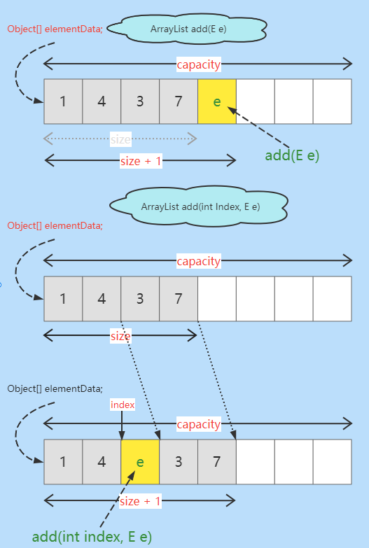
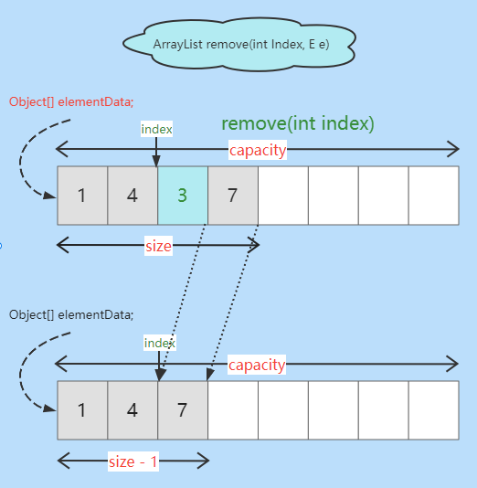

# ArrayList

## 简介
`ArrayList` 是 `List` 接口的可变数组的实现。  

`ArrayList` 是一个顺序容器，即元素存放的数据与放进去的顺序相同，且允许放入 `null` 元素，底层通过数组实现。 

Java 泛型只是编译器提供的语法糖，所以这里的数组是一个 `Object` 数组，以便能够容纳任何类型的对象。   

每个 `ArrayList` 都有一个容量 `capacity`，表示底层数组的实际大小，容器内存储元素的个数不能多于当前容量，
当向容器中添加元素时，如果容量不足，容器会自动扩容，增大底层数组的大小。

- `size()`, `isEmpty()`, `get()`, `set()` 方法均能在常数时间内完成  
- `add()` 方法的时间开销跟插入位置有关
- `addAll()` 方法的时间开销跟添加元素的个数成正比
- 其余方法大都是线性时间。 

> Tip: 为追求效率，`ArrayList` 没有实现同步`synchronized`，如果需要多个线程并发访问，用户可以手动同步，也可使用 `Vector` 替代。 
 
## 底层数据结构
```java
    /**
     * 底层数组
     */
    transient Object[] elementData; // non-private to simplify nested class access

    /**
     * 元素的个数
     * @serial
     */
    private int size;
```  

  

> `size` 是存储元素的实际个数， `capacity` 是底层数组的大小。

## 默认常量

```java
    /**
     * 默认初始容量 10
     */
    private static final int DEFAULT_CAPACITY = 10;

    /**
     * 共享空数组实例 
     */
    private static final Object[] EMPTY_ELEMENTDATA = {};

    /**
     * 默认初始容量的共享空数组实例，与 EMPTY_ELEMENTDATA 区分，用来了解添加第一个的元素的膨胀过程
     */
    private static final Object[] DEFAULTCAPACITY_EMPTY_ELEMENTDATA = {};

    /**
     * 数组的最大容量
     */
    private static final int MAX_ARRAY_SIZE = Integer.MAX_VALUE - 8;
```

## 构造方法

`ArrayList` 一共有以下三个构造方法  

```java
    /**
     * 构造一个具有指定初始容量的空列表。
     * @param  initialCapacity 列表的初始容量 the initial capacity of the list
     */
    public ArrayList(int initialCapacity) {
        if (initialCapacity > 0) {
            // 创建一个指定大小的数组
            this.elementData = new Object[initialCapacity];
        } else if (initialCapacity == 0) {
            // 引用共享空数组实例
            this.elementData = EMPTY_ELEMENTDATA;
        } else {
            throw new IllegalArgumentException("Illegal Capacity: "+ initialCapacity);
        }
    }

    /**
     * Constructs an empty list with an initial capacity of ten.
     * 构造一个初始容量为 10 的空列表
     */
    public ArrayList() {
        // 引用默认初始容量的共享空数组实例
        this.elementData = DEFAULTCAPACITY_EMPTY_ELEMENTDATA;
    }

    /**
     * 构造一个包含指定集合元素的列表
     */
    public ArrayList(Collection<? extends E> c) {
        Object[] a = c.toArray();
        if ((size = a.length) != 0) {
            if (c.getClass() == ArrayList.class) {
                elementData = a;
            } else {
                elementData = Arrays.copyOf(a, size, Object[].class);
            }
        } else {
            // replace with empty array.
            elementData = EMPTY_ELEMENTDATA;
        }
    }
```

## 自动扩容机制

每当向数组中添加元素时，都要去检查添加后元素的个数是否会超出当前数组的长度，如果超出，数组将会进行扩容，以满足添加数据的需求。  

数组扩容通过一个公开的方法 `ensureCapacity(int minCapacity)` 来实现。

> Tip: 数组进行扩容时，会将老数组中的元素重新拷贝一份到新的数组中，每次数组容量的增长大约是其原容量的 `1.5` 倍。这种操作的代价是很高的，因此在实际使用时，我们应该尽量避免数组容量的扩张。
> - 当我们可预知要保存的元素的多少时，在构造 `ArrayList` 实例时就指定其容量，以避免数组扩容的发生。
> - 或者根据实际需求，通过调用 `ensureCapacity` 方法来手动增加 `ArrayList` 实例的容量。  


```java
    /**
     * 确保容量
     * 确保数组容量最小是 minCapacity | 至少可存储 minCapacity 个元素
     * @param   minCapacity  所需最小容量/最少可存储元素个数  the desired minimum capacity
     */
    public void ensureCapacity(int minCapacity) {
        int minExpand = (elementData != DEFAULTCAPACITY_EMPTY_ELEMENTDATA)
            // 如果底层数组 不是默认初始容量的共享空数组实例
            ? 0
            // 如果底层数组 是默认初始容量的共享空数组实例
            : DEFAULT_CAPACITY;

        if (minCapacity > minExpand) {
            // 确保显式容量
            ensureExplicitCapacity(minCapacity);
        }
    }

    /**
     * 确保内部容量
     * 确保数组容量最小是 minCapacity | 至少可存储 minCapacity 个元素
     * @param   minCapacity  所需最小容量/最少可存储元素个数  the desired minimum capacity
     */
    private void ensureCapacityInternal(int minCapacity) {
        // 计算所需最小容量 -> 确保数组最小需要容量
        ensureExplicitCapacity(calculateCapacity(elementData, minCapacity));
    }

    /**
     * 确保显式容量
     * 确保数组容量最小是 minCapacity | 至少可存储 minCapacity 个元素
     * @param   minCapacity  所需最小容量/最少可存储元素个数  the desired minimum capacity
     */
    private void ensureExplicitCapacity(int minCapacity) {
        // 修改次数 +1
        modCount++;

        // overflow-conscious code
        // 如果 所需最小容量 大于 原数组 长度
        if (minCapacity - elementData.length > 0)
            // 扩容处理
            grow(minCapacity);
    }

    /**
     * 计算最小需要容量
     * - 如果数组是 默认初始容量的共享空数组实例 取 最小需要容量(minCapacity) 和 默认初始容量(DEFAULT_CAPACITY) 10 的较大值
     * - 否则 取参数 minCapacity 所需最小容量
     */
    private static int calculateCapacity(Object[] elementData, int minCapacity) {
        // 如果数组是 默认初始容量的共享空数组实例 
        if (elementData == DEFAULTCAPACITY_EMPTY_ELEMENTDATA) {
            // 取 所需最小容量(minCapacity) 和 默认初始容量(DEFAULT_CAPACITY) 10 的较大值。
            return Math.max(DEFAULT_CAPACITY, minCapacity);
        }
        // 取 所需最小容量(minCapacity)
        return minCapacity;
    }

    /**
     * 扩容 - 增加容量以确保至少可以容纳 minCapacity 元素数量
     * @param minCapacity 所需最小容量/最少可存储元素个数 
     */
    private void grow(int minCapacity) {
        // overflow-conscious code
        // 旧容量
        int oldCapacity = elementData.length;

        // 新容量 为 旧容量的 1.5 倍 (增加旧容量的一半)
        int newCapacity = oldCapacity + (oldCapacity >> 1);

        // 如果 新容量(增加旧容量的一半) 还是小于 所需最小容量
        if (newCapacity - minCapacity < 0)
            // 把 新容量 赋值为 参数 minCapacity 所需最小容量
            newCapacity = minCapacity;

        // 如果 新容量 大于最大数组容量
        if (newCapacity - MAX_ARRAY_SIZE > 0)
            // 进行巨大容量处理
            newCapacity = hugeCapacity(minCapacity);

        // minCapacity is usually close to size, so this is a win:
        // 赋值原底层数组内容 到 新的数组，再把新数组赋值给底层数组
        elementData = Arrays.copyOf(elementData, newCapacity);
    }

    /**
     * 巨大的容量
     * @param minCapacity 所需最小容量/最少可存储元素个数 
     */
    private static int hugeCapacity(int minCapacity) {
        // 如果 所需最小容量 范围溢出 则 抛异常
        if (minCapacity < 0) // overflow 
            throw new OutOfMemoryError();

        // 如果 所需最小容量 未范围溢出且大于数组最大容量，取整数最大值，否则取数组的最大容量
        return (minCapacity > MAX_ARRAY_SIZE) ?
            Integer.MAX_VALUE :
            MAX_ARRAY_SIZE;
    }
```

## 添加元素

添加单个元素    
- `add(E e)`列表末尾添加 -  确保容量后把元素附加在列表末尾
- `add(int index, E element)` 索引位置插入 - 需对索引位置越界检查及确保容量，再对元素进行移动，最后完成插入操作，也就意味着该方法有着线性的时间复杂度

  

```java
    /**
     * 添加元素 e 到列表末尾
     */
    public boolean add(E e) {
        // 确保数组容量足够，过程中 modCount +1
        ensureCapacityInternal(size + 1);  // Increments modCount!!

        // 列表末尾的下一个元素赋值为 添加的元素 e，并且 size +1
        elementData[size++] = e;
        return true;
    }

    /**
     * 在索引位置插入元素 当前位置及之后元素依次后移
     */
    public void add(int index, E element) {
        // 索引位置 - 数组越界检查
        rangeCheckForAdd(index);

        // 确保数组容量足够，过程中 modCount +1
        ensureCapacityInternal(size + 1);  // Increments modCount!!

        // 索引位置及之后的元素向后移动 - 数组复制的方式 System.arraycopy(源数组,源数组起始位置,目标数组,目标数组起始位置,复制的元素个数)
        System.arraycopy(elementData, index, elementData, index + 1, size - index);

        // 元素 element 覆盖索引位置上的值
        elementData[index] = element;

        // size +1
        size++;
    }
```

添加多个元素   
- `addAll(Collection<? extends E> c)` 末尾添加 - 把集合元素附加到列表末尾
- `addAll(int index, Collection<? extends E> c)` 索引位置开始插入 - 需对索引位置越界检查及确保容量，再对元素进行移动，最后完成插入操作，其时间复杂度不仅跟插入元素的多少有关，也跟插入的位置相关

```java
    /**
     * 将指定集合中的所有元素附加到此列表的末尾
     */
    public boolean addAll(Collection<? extends E> c) {
        // 集合转换为数组
        Object[] a = c.toArray();

        // 添加集合元素个数
        int numNew = a.length;

        // 确保数组容量足够
        ensureCapacityInternal(size + numNew);  // Increments modCount

        // 把集合转换的数组复制到 底层数组末尾
        System.arraycopy(a, 0, elementData, size, numNew);

        // size 加上集合元素个数
        size += numNew;
        return numNew != 0;
    }

    /**
     * 将指定集合中的所有元素插入到索引位置，索引位置及之后的元素顺序后移
     */
    public boolean addAll(int index, Collection<? extends E> c) {
        // 索引位置 - 数组越界检查
        rangeCheckForAdd(index);

        // 集合转换为数组
        Object[] a = c.toArray();

        // 添加集合元素个数
        int numNew = a.length;

        // 确保数组容量足够
        ensureCapacityInternal(size + numNew);  // Increments modCount
        
        // 底层数组需要后移的元素个数
        int numMoved = size - index;

        // 如果元素需要后移 -> 移动位置
        if (numMoved > 0)
            System.arraycopy(elementData, index, elementData, index + numNew, numMoved);
    
        // 从索引位置开始插入 集合元素
        System.arraycopy(a, 0, elementData, index, numNew);

        // size 加上集合元素个数
        size += numNew;
        return numNew != 0;
    }
```

## 移除元素

`remove()` 方法移除元素也有两个版本  
- `remove(int index)` 移除索引位置的元素 - 
- `remove(Object o)` 移除第一个匹配的元素 - 



```java
    /**
     * 移除索引位置的元素
     */
    public E remove(int index) {
        // 对索引位置越界检查
        rangeCheck(index);
        
        // 操作次数 +1
        modCount++;

        // 获取数组索引位置元素 其实就是: E oldValue = (E) elementData[index]
        E oldValue = elementData(index);

        // 移除元素后需向前移动的元素个数
        int numMoved = size - index - 1;
        
        // 如果有需要向前移动的元素
        if (numMoved > 0)
            // 向前移动元素
            System.arraycopy(elementData, index+1, elementData, index, numMoved);
        // /清除该索引位置的引用，让GC起作用
        elementData[--size] = null; // clear to let GC do its work
        
        // 返回索引位置上的值
        return oldValue;
    }

    /**
     * 移除第一个匹配的元素 
     * 思考：如果使用 Objects.equals(Object a, Object b)判断元素是否相等是否就不需要区分 null 了
     */
    public boolean remove(Object o) {
        // 如果需要移除的元素是 null
        if (o == null) {
            for (int index = 0; index < size; index++)
                // 遍历列表获取第一个 null 元素
                if (elementData[index] == null) {
                    // 移除该元素索引位置的值
                    fastRemove(index);
                    return true;
                }
        } 
        // 需要移除的元素不是 null 
        else {
            for (int index = 0; index < size; index++)
                // 遍历列表获取第一个等于 目标元素 的元素
                if (o.equals(elementData[index])) {
                    // 移除该元素索引位置的值
                    fastRemove(index);
                    return true;
                }
        }
        return false;
    }
```

## 设置(替换)元素

`set()` 方法 - 替换索引位置的值 
- `set(int index, E element)` `ArrayList` 底层是一个数组, `set()` 方法也就变得非常简单，直接对数组的索引位置赋值即可

```java
    /**
     * 替换索引位置的值
     */
    public E set(int index, E element) {
        // 索引位置进行越界检查
        rangeCheck(index);
        
        // 获取索引位置元素,其实就是: E oldValue = (E) elementData[index]
        E oldValue = elementData(index);
        
        // 覆盖原索引位置的值
        elementData[index] = element;
        
        // 返回旧值
        return oldValue;
    }
```

## 获取元素

`get()` 方法 - 获取索引位置的值 
- `get(int index)` 方法同样很简单，唯一要注意的是由于底层数组是Object[]，得到元素后需要进行类型转换

```java
    /**
     * 获取索引位置的值
     */
    public E get(int index) {
        // 索引位置进行越界检查
        rangeCheck(index);
        // 获取索引位置元素,其实就是: E oldValue = (E) elementData[index]
        return elementData(index);
    }
```

## ArrayList 常用方法一览

| Modifier and Type | Method and Description                                                                                                                   |
| :---------------- | :--------------------------------------------------------------------------------------------------------------------------------------- |
| `boolean`         | `add(E e)`将指定的元素追加到此列表的末尾。                                                                                               |
| `void`            | `add(int index, E element)`在此列表中的指定位置插入指定的元素。                                                                          |
| `boolean`         | `addAll(Collection<? extends E> c)`按指定集合的 Iterator 返回的顺序将指定集合中的所有元素追加到此列表的末尾。                            |
| `boolean`         | `addAll(int index, Collection<? extends E> c)`将指定集合中的所有元素插入到此列表中，从指定的位置开始。                                   |
| `void`            | `clear()`从列表中删除所有元素。                                                                                                          |
| `Object`          | `clone()`返回此 `ArrayList`实例的浅拷贝。                                                                                                |
| `boolean`         | `contains(Object o)`如果此列表包含指定的元素，则返回 `true` 。                                                                           |
| `void`            | `ensureCapacity(int minCapacity)`如果需要，增加此 `ArrayList`实例的容量，以确保它可以至少保存最小容量参数指定的元素数。                  |
| `void`            | `forEach(Consumer<? super E> action)`对 `Iterable`的每个元素执行给定的操作，直到所有元素都被处理或动作引发异常。                         |
| `E`               | `get(int index)`返回此列表中指定位置的元素。                                                                                             |
| `int`             | `indexOf(Object o)`返回此列表中指定元素的第一次出现的索引，如果此列表不包含元素，则返回-1。                                              |
| `boolean`         | `isEmpty()`如果此列表不包含元素，则返回 `true` 。                                                                                        |
| `Iterator<E>`     | `iterator()`以正确的顺序返回该列表中的元素的迭代器。                                                                                     |
| `int`             | `lastIndexOf(Object o)`返回此列表中指定元素的最后一次出现的索引，如果此列表不包含元素，则返回-1。                                        |
| `ListIterator<E>` | `listIterator()`返回列表中的列表迭代器（按适当的顺序）。                                                                                 |
| `ListIterator<E>` | `listIterator(int index)`从列表中的指定位置开始，返回列表中的元素（按正确顺序）的列表迭代器。                                            |
| `E`               | `remove(int index)`删除该列表中指定位置的元素。                                                                                          |
| `boolean`         | `remove(Object o)`从列表中删除指定元素的第一个出现（如果存在）。                                                                         |
| `boolean`         | `removeAll(Collection<?> c)`从此列表中删除指定集合中包含的所有元素。                                                                     |
| `boolean`         | `removeIf(Predicate<? super E> filter)`删除满足给定谓词的此集合的所有元素。                                                              |
| `protected void`  | `removeRange(int fromIndex, int toIndex)`从这个列表中删除所有索引在 `fromIndex` （含）和 `toIndex`之间的元素。                           |
| `void`            | `replaceAll(UnaryOperator<E> operator)`将该列表的每个元素替换为将该运算符应用于该元素的结果。                                            |
| `boolean`         | `retainAll(Collection<?> c)`仅保留此列表中包含在指定集合中的元素。                                                                       |
| `E`               | `set(int index, E element)`用指定的元素替换此列表中指定位置的元素。                                                                      |
| `int`             | `size()`返回此列表中的元素数。                                                                                                           |
| `void`            | `sort(Comparator<? super E> c)`使用提供的 `Comparator`对此列表进行排序以比较元素。                                                       |
| `List<E>`         | `subList(int fromIndex, int toIndex)`返回此列表中指定的 `fromIndex` （包括）和 `toIndex`之间的独占视图。                                 |
| `Object[]`        | `toArray()`以正确的顺序（从第一个到最后一个元素）返回一个包含此列表中所有元素的数组。                                                    |
| `<T> T[]`         | `toArray(T[] a)`以正确的顺序返回一个包含此列表中所有元素的数组（从第一个到最后一个元素）; 返回的数组的运行时类型是指定数组的运行时类型。 |
| `void`            | `trimToSize()`修改这个 `ArrayList`实例的容量是列表的当前大小。                                                                           |


## 阅读资料

- [全栈知识体系-ArrayList源码解析](https://www.pdai.tech/md/java/collection/java-collection-ArrayList.html)
- [CarpenterLee-ArrayList源码解析](https://www.cnblogs.com/CarpenterLee/p/5419880.html)
- [zhangshixi-ArrayList源码解析](https://www.iteye.com/blog/zhangshixi-674856)
- [Java 8 在线文档](https://www.matools.com/api/java8)