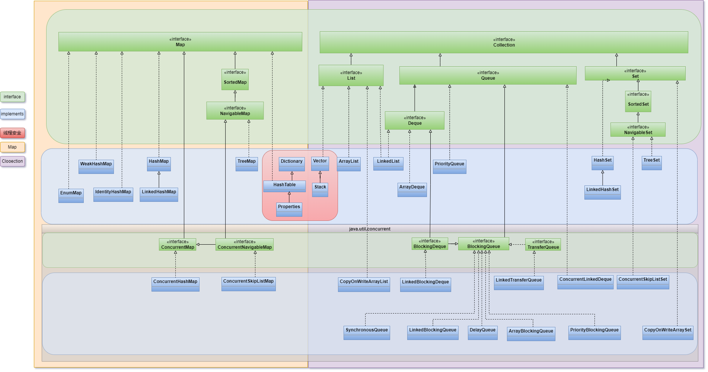
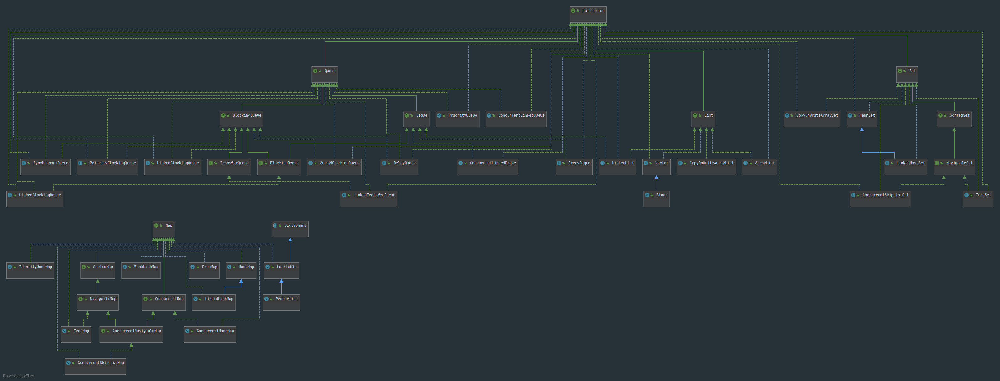

# Java 容器 <!-- {docsify-ignore-all} -->

* [ArrayList](ArrayList)
    
## 类关系图

[新标签页中打开查看](../../../imgs/Java容器体系.png ':ignore')

## Idea查看类关系图

[新标签页中打开查看](../../../imgs/Java容器体系-Idea.png ':ignore')

## 简介

容器就是可以存放对象的对象！  

> Java 中有两种容器，`Collection` 和 `Map`  
> - `Collection` 存储对象的集合
> - `Map` 存储键值对(两个对象)的映射表
 
## List
 
### ArrayList

基于动态数组实现，支持随机访问

### Vector

 和 `ArrayList` 类似，但它是线程安全的

### LinkedList

基于双向链表实现，只能顺序访问，但是可以快速地在链表中间插入和删除元素。不仅如此，`LinkedList` 还可以用作栈、队列和双向队列

## Set

### TreeSet 

基于红黑树实现，支持有序性操作，例如根据一个范围查找元素的操作。但是查找效率不如 `HashSet`，`HashSet` 查找的时间复杂度为 O(1)，`TreeSet` 则为 O(logN)。

### HashSet 

基于哈希表实现，支持快速查找，但不支持有序性操作。并且失去了元素的插入顺序信息，也就是说使用 `Iterator` 遍历 `HashSet` 得到的结果是不确定的

### LinkedHashSet

具有 `HashSet` 的查找效率，且内部使用双向链表维护元素的插入顺序
 
## Queue
 
### LinkedList

可以用它来实现双向队列。
 
### PriorityQueue

 基于堆结构实现，可以用它来实现优先队列
 
## Map

### TreeMap 

基于红黑树实现

### HashMap 

基于哈希表实现

### HashTable 

和 `HashMap` 类似，但它是线程安全的，这意味着同一时刻多个线程可以同时写入 `HashTable` 并且不会导致数据不一致。它是弃用类，不应该去使用它。
现在可以使用 `ConcurrentHashMap` 来支持线程安全，并且 `ConcurrentHashMap` 的效率会更高，因为 `ConcurrentHashMap` 引入了分段锁

### LinkedHashMap

使用双向链表来维护元素的顺序，顺序为插入顺序或者最近最少使用(LRU)顺序

## 阅读资料

- [全栈知识体系-Java集合框架](https://www.pdai.tech/md/java/collection/java-collection-all.html)
- [github - CarpenterLee/JCFInternals](https://github.com/CarpenterLee/JCFInternals)
