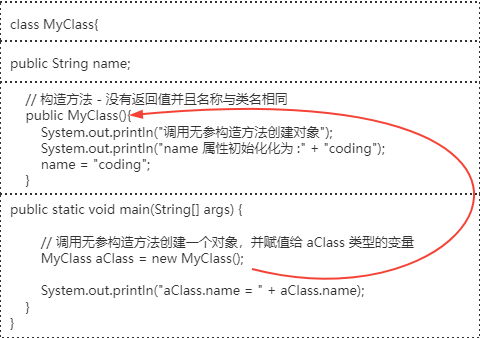
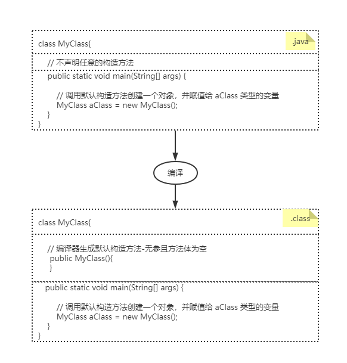

# 构造方法

构造方法是初始化新建对象的代码块，有点类似方法但又不是方法，构造方法没有返回值并且名称只能与类名相同。

构造方法通常被称作一种特殊类型的方法。

示例代码：  
```java
class MyClass{
    // 构造方法 - 没有返回值并且名称与类名相同
    public MyClass(){
    
    }
}
```
> Tip: 构造方法 - 没有返回值并且名称与类名相同
## 本篇目录
- [构造方法工作原理](#构造方法工作原理)
- [构造方法的类型](#构造方法的类型)
- [构造方法调用链](#构造方法调用链)
- [构造方法重载](#构造方法重载)

## 构造方法工作原理
我们用代码举个例子来理解构造方法的工作原理。  

  

output:  
```shell script
调用无参构造方法创建对象
name 属性初始化化为 :coding
aClass.name = coding
```

通过上面的代码我们可以知道，用 `new` 关键字调用构造方法创建对象并返回对象的引用地址。

## 构造方法的类型

- [默认构造方法](#默认构造方法)
- [无参构造方法](#无参构造方法)
- [有参构造方法](#有参构造方法)

### 默认构造方法

如果代码中没有明确声明任意构造方法，Java 编译器会生成一个默认的构造方法插入我们的代码中。   

默认构造方法不会出现在 Java 源代码文件中(`.java`)，它是在编译后直接插入字节码文件中(`.class`)。

过程如下：  
  

> Tip: 如果声明了任意构造方法，编译器就不会再生成默认得构造方法。

### 无参构造方法

没有参数的构造方法称为无参构造方法，它的签名与默认构造方法一样，但是无参构造方法可以在方法体中写任意代码,
而不像默认构造方法那样方法体为空。  
就如[构造方法工作原理](#构造方法工作原理)例子中声明的无参构造方法那样。

> Tip: 即使我们自己声明一个无参且方法体为空的构造方法，它也不是默认构造方法！

### 有参构造方法

带参数的构造方法成为有参构造方法。  
示例如下：  
```java
class MyClass2{
    public String name;
    // 有参构造方法 - 没有返回值并且名称与类名相同
    public MyClass2(String name){
        System.out.println("调用有参构造方法创建对象");
        System.out.println("name 属性初始化为参数 name 值:" + name);
        this.name = name;
    }

    public static void main(String[] args) {
        // 调用有参构造方法创建一个对象，并赋值给 aClass 类型的变量
        MyClass2 aClass = new MyClass2("coding class");
        System.out.println("aClass.name = " + aClass.name);
    }
}
```
output:  
```shell script
调用有参构造方法创建对象
name 属性初始化为参数 name 值:coding class
aClass.name = coding class
```
## 构造方法调用链

每当子类构造方法被调用时，它就隐式地调用父类的构造方法，也可以说编译器插入了一个 `super();` 语句在子类构造方法的开头。  

继承中类的初始化顺序
初始化顺序：
1. 父类–静态变量/父类–静态初始化块
1. 子类–静态变量/子类–静态初始化块
1. 父类–变量/父类–初始化块
1. 父类–构造器
1. 子类–变量/子类–初始化块
1. 子类–构造器

验证类的初始化顺序示例代码：  

```java
class ConstructorChain {

    public static void main(String[] args) {
        System.out.println("<=========son 2===========>");
        Son son = new Son();
        System.out.println("<=========son 2===========>");
        Son son2 = new Son("son2");
    }
}

// 父类，基类
class Father{
    private String name;

    public static int step = 1;
    // 静态代码按定义顺序从上往下执行，所有这里先定义了 step
    static {
        System.out.println(Father.step++ + "-父类-静态变量初始化");
        System.out.println(Father.step++ + "-父类-静态代码块初始化");
    }

    public int var = Father.step++;
    // 初始化块
    {
        System.out.println(var + "-父类-成员变量初始化");
        System.out.println(Father.step++ + "-父类-初始化块初始化");
    }
    public Father(){
        System.out.println(Father.step++ + "-父类-无参构造方法初始化");
    }


    public Father(String name) {
        this.name = name;
        System.out.println(Father.step++ + "-父类-有参构造方法初始化");
    }
}

// 子类、衍生类
class Son extends Father{

    public static int sonStation = Father.step++;
    static {
        // 静态代码按定义顺序从上往下执行，所有这里先定义了 step
        System.out.println(sonStation + "-子类-静态变量初始化");
        System.out.println(Father.step++ + "-子类-静态代码块初始化");
    }

    public int var = Father.step++;
    // 初始化块
    {
        System.out.println(var + "-子类-成员变量初始化");
        System.out.println(Father.step++ + "-子类-初始化块初始化");
    }

    // 调用自己的无参构造方法
    public Son() {
        // 调用父类的无参构造方法,写或不写都会默认生成
        // 如果父类没有无参构造方法，必须指明调用那个构造方法
        // super();
        System.out.println(Father.step++ + "-子类-无参构造方法初始化");
    }

    public Son(String name) {
        // 在子类构造方法中的第一行语句，使用 super 调用父类构造方法
        super(name); // 调用父类的有参构造方法
        System.out.println(Father.step++ + "-子类-有参构造方法初始化");
    }
}
```
output:  
```shell script
<=========son 1===========>
1-父类-静态变量初始化
2-父类-静态代码块初始化
3-子类-静态变量初始化
4-子类-静态代码块初始化
5-父类-成员变量初始化
6-父类-初始化块初始化
7-父类-无参构造方法初始化
8-子类-成员变量初始化
9-子类-初始化块初始化
10-子类-无参构造方法初始化
<=========son 2===========>
11-父类-成员变量初始化
12-父类-初始化块初始化
13-父类-有参构造方法初始化
14-子类-成员变量初始化
15-子类-初始化块初始化
16-子类-有参构造方法初始化
```

> Tip；  
> - 子类的静态变量和静态初始化块的初始化是在父类的变量、初始化块和构造器初始化之前
> - 静态变量、静态初始化块顺序取决于它们在类中出现的先后顺序
> - 变量、初始化块初始化顺序取决于它们在类中出现的先后顺序
> - 静态变量、静态初始化块只会初始化一次

## 构造方法重载

构造方法重载是指拥有多个具有不同参数列表的构造方法，以便每个构造方法执行不同的任务，和方法重载方法类似。  
如下示例：  
```java
public class ConstructorTest {
    public static void main(String[] args) {
        // 无参构造方法创建对象
        User obj1 = new User();
        // 有参构造方法创建对象
        User obj2 = new User("lax", 19);
        System.out.println(obj1.name + "-" + obj1.age);
        System.out.println(obj2.name + "-" + obj2.age);
    }
}
class User{
    String name;
    int age;
    // 默认的构造器——如果没有主动声明任何构造器，编译器会自动给我们生成在字节码文件中 (.class)
    // public ConstructorTest() {
    // }

    // 无参构造器
    public User() {
        this.name = "jinx";
        this.age = 18;
    }
    // 参数化构造器
    public User(String name, int age) {
        this.name = name;
        this.age = age;
    }
}
```
output:  
```shell script
jinx-18
lax-19
```

## 快速回顾

- 每个类都有一个构造方法，无论是正常的类还是抽象类，如果您没有在类中实现任何构造方法，则编译器将生成一个默认构造方法在字节码中

- 构造方法不是方法，它们没有任何返回类型

- 构造方法名称应与类名匹配

- 构造方法可以使用任何访问说明符

- 与构造方法方法一样，也可以具有与类名相同的名称的方法，我们判断否具有返回值类型来区分它是否是构造方法

- 构造方法可以重载，但不可能覆盖

- 构造方法无法继承。

- 接口没有构造方法，抽象类可以具有构造方法

- `this();` 和 `super();` 应该是构造方法代码中的第一个语句 - 如果没有显式使用，编译器会相应地为您提供

- 构造方法还可以通过使用 `this();` 来调用同一类的另一个构造方法。如果要调用参数化构造方法，则这样做：`this(参数列表);`。

- 如果父类没有无参构造方法或默认构造方法，则在正常情况下编译器不会在子类中插入默认构造方法，
需要自己显示声明一个构造方法，并在代码中第一句用 `this(参数列表);` 显示调用父类的构造方法。


## 构造方法和方法之间的差异

1. 构造方法的目的是初始化类的对象，而方法的目的是通过执行 Java 代码来执行任务

1. 构造方法不能用 `abstract`, `final`, `static` 和 `synchronised` 修饰，而方法可以

1. 构造方法在方法执行时没有返回类型